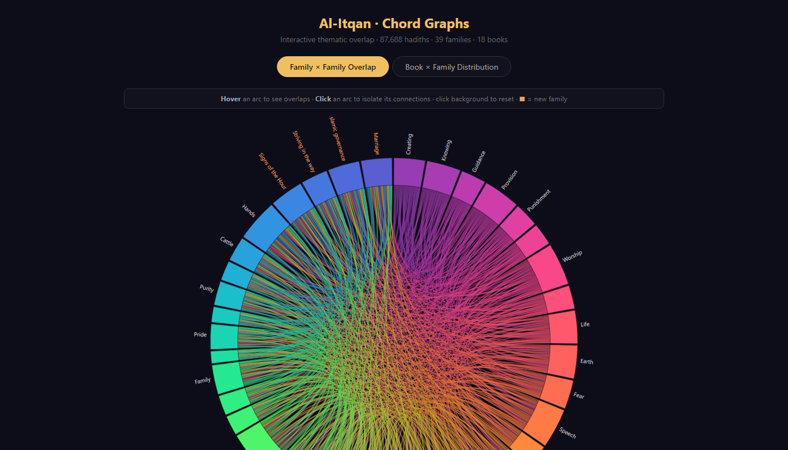
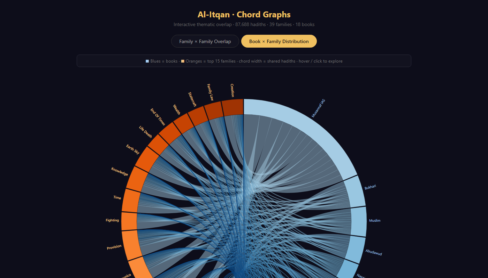
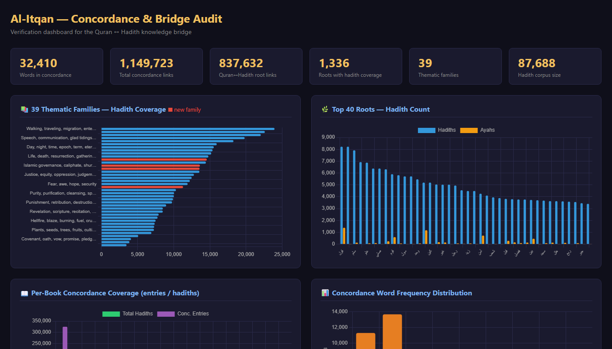

# Al-Itqan (الإتقان) — Quran–Hadith Knowledge Bridge

> *"Itqan"* (إتقان) means mastery, perfection, and precision in craft. This project applies that principle to Islamic source texts: every connection between the Quran and the Hadith corpus is grounded in classical Arabic root morphology, not keyword guessing.

A fully static, offline-capable Islamic study platform connecting **87,688 Sunni hadiths** across **18 books** to the **Quran** through **1,651 Arabic roots** and **39 thematic families** — with no backend, no database, and no API required.

---

## What This Is

Most Quran/Hadith apps do English keyword search on translations. Al-Itqan operates at the level classical scholars worked: **Arabic root morphology**. The root `صوم` connects every Quran verse about fasting to every hadith whose Arabic text contains a word derived from that root — whether the word is `صيام`, `يصوم`, `الصائم`, `صُمْتُ`, or `صوموا`. One root, all its forms, across both corpora at once.

The result is a set of open JSON files that any developer can load and build on, plus a live web app that uses them.


**Live app:** deployed on Netlify (static, no server)
**Corpus:** 87,688 Sunni hadiths + standalone Shia database
**Quran roots:** 1,651 unique roots, 6,236 ayahs
**Cross-references:** 837,632 Quran↔Hadith root connections
**Thematic families:** 39 (35 classical + 4 new: End of Times, Jihad, Statecraft, Family Law)

---

## The Data Pipeline

```
RAW HADITH TEXT (Arabic, 18 books, 87,688 hadiths)
        │
        ▼
  CAMeL Tools — Cairo Arabic NLP Toolkit
  Morphological analyzer (MSA + Classical Arabic)
  For every word: root, lemma, POS, verb form (I–X), voice, aspect
        │
        ▼
  word_defs_v2.json                   32,413 Arabic words → root assignments
        │
  + patch_word_defs.py                Manual fixes for CAMeL Tools gaps:
    • يوم (day/Qiyama) — 14 forms added (was completely absent)
    • أمر (command/authority) — 30 forms added
    • ولي (guardian/wilaya) — 22 forms added
    • أرض (earth) — 13 forms added
    • وقي (taqwa/piety) — 19 forms added
    • فتن (fitnah) — 5 wrong root assignments fixed (فوت→فتن)
    • أمن (faith/iman) — alias added (CAMeL uses ومن form)
        │
        ▼
  concordance.json                    Inverted index (Mu'jam al-Mufahris)
  Every Arabic word → list of hadith IDs that contain it
  32,410 words · 1,149,723 total entries · cap 2,000 per word
        │
        │          Quran roots_index.json   (1,651 roots + ayah lists)
        │          families.json            (39 thematic families → roots)
        │          mufradat.json            (Raghib al-Isfahani lexicon)
        │          roots_lexicon.json       (Lane's Lexicon)
        │          root_alias_map.json      (131 CAMeL↔Quran form fixes)
        │
        ▼
  build_bridge.py
  For each Quran root → find all hadith words with that root (via alias map)
  → look up each word in concordance → collect all hadith IDs
        │
        ▼
  quran_hadith_bridge.json            1,651 roots fully connected
  837,632 total Quran↔Hadith root links
        │
        ▼
  family_corpus.json                  39 thematic families
  Each family: all reachable hadiths across all 18 books,
  ayah list, root stats, book breakdown
```

### Root Canonicalization: The Hidden Problem

CAMeL Tools and the Quran roots index use different canonical forms for the same root. This is a known NLP challenge with Arabic:

| Root concept | Quran form | CAMeL form | Type |
|---|---|---|---|
| judgment/judiciary | قضي | قضو | Defective verb (ي→و) |
| pledge/sale | بيع | بوع | Hollow verb (middle ي→و) |
| faith/belief | أمن | ومن | Hamza normalization |
| guide | هدي | هدو | Defective verb |

**Fix:** `src/root_alias_map.json` — 131 entries mapping Quran root forms to CAMeL canonical forms. `build_bridge.py` applies this map before looking up words, recovering **4,977 additional word→root mappings**.

---

## The JSON Files

### `word_defs_v2.json` (6.7 MB)

The morphological dictionary. Every significant Arabic word in the corpus mapped to its root and definition.

```json
"صلي": {
  "r":   "صلو",
  "g":   "to pray, perform the ritual prayer",
  "d":   "Lane's Lexicon full definition (truncated to 500 chars)...",
  "n":   2847,
  "lem": "صلى",
  "pos": "verb",
  "form": "I"
}
```

| Field | Meaning |
|---|---|
| `r` | Arabic root (CAMeL canonical form) |
| `g` | Short gloss |
| `d` | Lane's Lexicon definition |
| `n` | Corpus frequency (how many hadiths contain this word) |
| `lem` | Lemma (base form) |
| `pos` | Part of speech |
| `form` | Verb form I–X (if verb) |
| `_patched` | `true` if added by patch script, not CAMeL |

**Power:** Any Arabic word in any hadith is one lookup away from its root, grammar, and classical definition. Foundation of the word panel, root navigation, and cross-reference features.

---

### `concordance.json` (22 MB)

The **Mu'jam al-Mufahris** — the classical concordance index. Medieval scholars like Fuad Abd al-Baqi spent decades compiling this by hand. Here it is computed.

```json
"صلاه":  ["bukhari:2",   "muslim:5",   "abudawud:12",  ...],
"يوم":   ["bukhari:1",   "musannaf_ibnabi_shaybah:47", ...],
"تقوي":  ["tirmidhi:4",  "bukhari:6551", ...]
```

- **32,410 words** indexed
- **1,149,723 total entries** (word × hadith pairs)
- Cap of **2,000 hadith IDs per word** (prevents ultra-common words from dominating)
- IDs format: `book_id:hadith_number_in_book`

**Power:** Click any Arabic word in the reader → instantly retrieve every hadith in the corpus that contains it, across all 18 books. Full-text search with zero search engine infrastructure.

---

### `quran_hadith_bridge.json` (21 MB)

The core innovation. Every Quran root connected to its hadiths, with classical definitions from two sources.

```json
"صوم": {
  "ayahs":         ["2:183", "2:184", "2:185", "2:187", ...],
  "ayah_count":    14,
  "hadith_ids":    ["bukhari:1771", "muslim:2502", "nasai:2106", ...],
  "hadith_count":  892,
  "book_breakdown": {
    "musannaf_ibnabi_shaybah": 312,
    "bukhari": 124,
    "muslim":  98,
    "nasai":   87
  },
  "words_in_hadith": ["صوم", "صيام", "يصوم", "الصائم", "صوموا", ...],
  "families":      ["worship", "purity"],
  "definitions": {
    "quran_meaning": "fasting, abstaining from food and desire",
    "mufradat":      "Raghib al-Isfahani: صوم means to restrain oneself...",
    "lanes":         "Lane's Lexicon: the act of abstaining from food..."
  },
  "frequency_quran": 14
}
```

| Field | Meaning |
|---|---|
| `ayahs` | All Quran verse references containing this root |
| `hadith_ids` | All hadith IDs whose Arabic text contains a word from this root |
| `book_breakdown` | Per-book count of matched hadiths |
| `words_in_hadith` | The actual Arabic word forms found in the corpus |
| `families` | Which thematic families this root belongs to |
| `definitions.mufradat` | Classical definition from Raghib al-Isfahani (d. 1108 CE) |
| `definitions.lanes` | Definition from Edward William Lane's Arabic–English Lexicon |

**Power:** Open any Quran ayah → surface every related hadith. Open any hadith → see which Quranic roots its vocabulary maps to. The cross-reference layer that no existing open-source Quran/Hadith app has at this depth.

---

### `family_corpus.json` (12.6 MB)

39 thematic families, each a pre-curated corpus spanning both Quran and Hadith.

```json
"end_of_times": {
  "name_ar":     "أشراط الساعة والأخروية",
  "meaning":     "Signs of the Hour, eschatology, resurrection, grave, trials before the Day of Judgment",
  "roots":       ["فتن", "قوم", "بعث", "حشر", "نفخ", "قبر", "موت", "روح", ...],
  "root_count":  24,
  "ayah_count":  1388,
  "hadith_count": 14572,
  "hadith_ids":  [...],
  "book_breakdown": {
    "musannaf_ibnabi_shaybah": 4821,
    "bukhari": 621,
    "muslim":  534
  },
  "root_stats": [
    {"root": "فتن", "ayah_count": 58,  "hadith_count": 360},
    {"root": "قوم", "ayah_count": 70,  "hadith_count": 2140},
    {"root": "بعث", "ayah_count": 67,  "hadith_count": 890}
  ]
}
```

**The 39 families:**

| Family | Ayahs | Hadiths | Notes |
|---|---|---|---|
| movement_journey | 2,550 | 23,934 | Travel, migration, Hajj |
| worship | 2,748 | 22,596 | Prayer, fasting, zakat, Hajj |
| body | 1,131 | 22,037 | Purity, medicine, physical acts |
| speech_communication | 2,083 | 19,808 | Truthfulness, oaths, rhetoric |
| provision | 1,208 | 18,255 | Wealth, trade, sustenance |
| fighting | 706 | 15,947 | Battle, defense, weapons |
| time | 1,408 | 15,540 | Days, seasons, sacred times |
| knowledge | 2,163 | 15,370 | Learning, teaching, scholarship |
| earth_sky | 1,380 | 15,184 | Cosmology, nature, agriculture |
| life_death | 1,079 | 14,795 | Soul, death, afterlife |
| **end_of_times** ★ | 1,388 | 14,572 | Eschatology, Dajjal, signs of Hour |
| wealth | 449 | 14,447 | Inheritance, charity, economics |
| **statecraft** ★ | 1,914 | 13,624 | Caliphate, governance, bay'a |
| **family_law** ★ | 741 | 13,576 | Marriage, divorce, inheritance |
| creation | 2,437 | 13,553 | Origins, cosmogony |
| justice | 2,071 | 12,795 | Courts, equity, rights |
| ... | | | |
| **jihad** ★ | 708 | 11,291 | Striving, martyrdom, conquest |
| ... | | | |
| deception_hypocrisy | 354 | 3,479 | Nifaq, lying, betrayal |

★ = new families added in this project

**Power:** A researcher studying eschatology calls `family_corpus["end_of_times"].hadith_ids` and gets 14,572 pre-identified hadiths across 18 books, cross-referenced to 1,388 Quran ayahs, broken down by root — without writing a single database query.

---

### `narrator_index.json` (0.6 MB)

Every narrator name found in the corpus, with hadith counts and book distribution.

```json
"أبو هريرة": {
  "total": 5374,
  "books": {
    "bukhari": 446,
    "muslim":  618,
    "abudawud": 977
  },
  "grade": "thiqah"
}
```

**Power:** Foundation for the isnad visualizer. Any narrator → their full transmission record across all 18 books.

---

### `hadith_connections.json` (4.2 MB)

Cross-book connections: hadiths that share matn (text), topic, or ruling pattern.

```json
"bukhari:1": {
  "connected": [
    {"id": "muslim:1907", "type": "shared_matn",  "score": 0.94},
    {"id": "nasai:75",    "type": "shared_ruling", "score": 0.71}
  ]
}
```

**Power:** "See also" links across books. When a user reads Bukhari:1, they can navigate to the same hadith in Muslim, Nasa'i, and other books instantly.

---

### Supporting files

| File | Size | Contents |
|---|---|---|
| `roots_lexicon.json` | 1.5 MB | 1,651 roots → Lane's Lexicon full definitions |
| `src/root_alias_map.json` | 2 KB | 131 CAMeL↔Quran root form corrections |
| `src/bridge_analysis.json` | 48 KB | Cross-correlation stats, rank comparisons, top ayahs |
| `app/chord_matrices.json` | 13 KB | Pre-computed 39×39 overlap matrix for chord graphs |

---

## The Chord Graphs

`app/chord.html` — a self-contained interactive visualization (no server needed, data embedded inline).


*39 thematic families as arcs — chord width = number of hadiths shared between two families*


*Blues = 18 books, Oranges = top 15 families — chord width = hadith contribution*

### Tab 1: Family × Family Overlap

A D3.js chord diagram with 39 arcs (one per family). The width of each chord between two arcs equals the number of hadiths that belong to **both** families simultaneously.

**What it reveals:**

- **worship ↔ movement_journey** — thick chord: prayer hadiths reference prostration, standing, and travel to the mosque; pilgrimage hadiths reference prayer at every station
- **statecraft ↔ justice** — thick chord: Islamic governance and judicial fairness are treated as inseparable in hadith literature; the qadi (judge) and the caliph appear in the same hadiths
- **end_of_times ↔ life_death** — expected overlap: resurrection, the grave, and the soul sit in both families
- **family_law ↔ provision** — thick chord: marriage contracts, mahr, and nafaqa (maintenance) are economic as much as personal
- **jihad ↔ fighting** — overlapping but distinct: jihad roots (جهد, شهد, غزو) are more specific than the broader fighting family (حرب, قتل, سلح)

**Interaction:** hover any arc → see its total hadith count and top 4 overlapping families. Click to isolate all its chords. Click background to reset.

### Tab 2: Book × Family Distribution

Blues = 18 books. Oranges = top 15 families. Each chord = "this book contributes X hadiths to this family."

**What it reveals:**

- **Musannaf Ibn Abi Shaybah** is the dominant blue arc: 37,943 hadiths (43% of the corpus) means it feeds every family substantially, often more than all other books combined
- **Bukhari and Muslim** are smaller arcs but their chords to `worship` and `knowledge` are proportionally large — these sahih collections are denser in legal/theological hadiths per page
- **Shamail al-Muhammadiyah** connects heavily to `body` and `speech_communication` — it is a book specifically about the Prophet's physical appearance and character
- **Nawawi 40, Qudsi 40** are tiny arcs but connect disproportionately to `knowledge`, `guidance`, `heart_soul` — they are curated theological summaries, each hadith carefully chosen
- **Shah Waliullah 40** barely registers — its hadiths are very short matn-only texts with minimal vocabulary for the concordance to index

---

## The Concordance Audit Dashboard

`app/concordance_audit.html` — a Chart.js verification dashboard used during development.


*Five-chart data quality dashboard: family coverage, top roots, per-book indexing, word frequency, and Quran↔Hadith correlation*

Five charts:
1. **39 families bar chart** — hadith coverage per family, new families highlighted in red
2. **Top 40 roots** — hadith count vs ayah count side by side; shows which roots are over/under-represented between the two corpora
3. **Per-book coverage** — total hadiths vs concordance entries per book; verifies every book is indexed
4. **Word frequency distribution** — histogram of how many words appear in 1–4 hadiths vs 5–19 vs ... vs 2000 (cap). Most words are rare; ~81 words hit the 2000 cap including صلي, قال, كان
5. **Quran freq vs Hadith count scatter** — hover any dot to see root + meaning. Shows rough positive correlation but interesting outliers: roots frequent in Quran but rare in Hadith (abstract theological), and roots rare in Quran but very frequent in Hadith (legal practice detail)

---

## The AI Layer — Three Integrated Engines

This repo contains the **data layer** that powers Al-Itqan. Three open-source tools form the **AI layer**, running on HuggingFace Spaces as optional APIs on top of the fully-static core.

| Engine | Space | Status |
|--------|-------|--------|
| KASHAF — Isnad Visualizer | (local, `app/isnad.html`) | ✅ Integrated |
| BasilSuhail — Semantic Search | [iqrossed/al-itqan-search](https://huggingface.co/spaces/iqrossed/al-itqan-search) | ✅ Deployed |
| HadithRAG — Conversational Q&A | [iqrossed/al-itqan-rag](https://huggingface.co/spaces/iqrossed/al-itqan-rag) | ✅ Deployed |

The FAISS semantic index (87,056 hadiths, `intfloat/multilingual-e5-small`, 216MB) is hosted at [`iqrossed/al-itqan-index`](https://huggingface.co/datasets/iqrossed/al-itqan-index) and shared by both Spaces.

### KASHAF — Isnad Visualizer
**Source:** `github.com/OmarShafie/hadith`
**What it is:** A Sankey/flow diagram that shows how a hadith was transmitted: narrator A → narrator B → narrator C → the Prophet (ﷺ). Built with Papa Parse + PEG.js for parsing chains, Google Charts for the Sankey.
**Current state:** Works only for Bukhari, loads a static CSV, uses Google Charts (requires internet).
**What Al-Itqan takes:**
- The Sankey data model: `[source_narrator, target_narrator, hadith_count]` rows
- The narrator reliability color-coding logic (thiqah = green, da'if = red, unknown = grey)

**What Al-Itqan changes:**
- Google Charts → **D3-sankey** (MIT, self-hosted, offline-capable)
- Bukhari-only CSV → `narrator_index.json` across **all 18 books**
- Static CSV → dynamic: user selects book, transmission depth, minimum chain length
- Every narrator arc links to their full hadith list in the reader

**Status:** Planned for Phase 2. Not yet built into this repo.

---

### BasilSuhail — Semantic Search
**Source:** `github.com/BasilSuhail/Quran-Hadith-Application-Database`
**What it is:** A Flask app using FAISS (Facebook AI Similarity Search) + `all-MiniLM-L6-v2` sentence embeddings to do semantic search over a ~15k hadith subset. Type "forgiveness of sins" → get the most semantically similar hadiths even if the exact words don't match.
**Current state:** Works but uses an English-first embedding model on Arabic text, covers only ~15k hadiths, runs as a local Flask server.
**What Al-Itqan takes:**
- The two-corpus unified search concept (Quran + Hadith in one query)
- The FAISS nearest-neighbor retrieval pattern
- The result schema: `{type, text, reference, score}`

**What Al-Itqan upgrades:**
- 15k hadiths → **87,688 hadiths** (all books)
- `all-MiniLM-L6-v2` (English-first) → **`CAMeL-Lab/bert-base-arabic-camelbert-ca`** (Classical Arabic domain, Apache-2.0) with mean-pool to produce sentence vectors
- Flask local server → **HuggingFace Spaces** (Gradio, free GPU hosting)
- No context → **every result tagged with root family** from `quran_hadith_bridge.json`, so "find hadiths about mercy" surfaces results with the `رحم` root highlighted

**Pre-computation pipeline** (to be built as `src/build_semantic_index.py`):
1. Embed each hadith's Arabic matn with camelbert-ca
2. Build FAISS IndexFlatIP (cosine similarity on L2-normalised vectors)
3. Save: `semantic_index.faiss` + `semantic_meta.json`
4. Deploy on HuggingFace Space

**API contract:**
```
GET /search?q=مكارم+الأخلاق&limit=10&filter_family=knowledge&filter_grade=sahih
→ [{type, text, reference, score, family, grade}, ...]
```

**Status:** Planned for Phase 3. Not yet built. The root bridge data is ready to enrich it when it is.

---

### HadithRAG — Conversational Q&A
**Source:** `github.com/Quchluk/HadithRAG`
**What it is:** A RAG (Retrieval-Augmented Generation) pipeline using ChromaDB + a language model. Ask a question → retrieve relevant hadiths from vector store → generate a cited answer. The key innovation in HadithRAG is storing the full isnad (chain of narration) in the vector metadata, so the LLM can include the chain in its answer.
**Current state:** Prototype with a small corpus, ChromaDB, and GPT-4 as the generator.
**What Al-Itqan takes:**
- The isnad-preserving schema: full chain text stored in vector metadata, not stripped out
- The retrieval loop: query → top-K hadiths → LLM generates answer with citations

**What Al-Itqan upgrades:**
- Small prototype corpus → **87,688 hadiths**
- GPT-4 (costly, proprietary) → **Qwen2.5-7B + hadith LoRA** (open, HuggingFace hosted)
- ChromaDB (local) → **FAISS** (same index as BasilSuhail, one unified semantic layer)
- No root context → **root family + grade injected into prompt**: *"The retrieved hadiths belong to the `statecraft` family, with roots ملك, حكم, خلف. Grade: 3 sahih, 2 hasan."*

**Status:** Planned for Phase 4. Not yet built.

---

## Architecture

```
┌─────────────────────────────────────────────────────────────┐
│              STATIC LAYER  (Netlify / GitHub Pages)          │
│          Vanilla JS + CSS — offline-capable PWA              │
│                                                              │
│  ┌─────────────┐  ┌──────────────┐  ┌──────────────────┐   │
│  │  READER     │  │  THEMATIC    │  │  ROOT EXPLORER   │   │
│  │  Quran +    │  │  STUDY       │  │  root → ayahs +  │   │
│  │  Hadith     │  │  39 families │  │  hadiths + defs  │   │
│  │  side-panel │  │  corpus view │  │  Lane's+Mufradat │   │
│  └─────────────┘  └──────────────┘  └──────────────────┘   │
│                                                              │
│  ┌──────────────────────────────────────────────────────┐   │
│  │  ISNAD VISUALIZER  (KASHAF engine, D3 Sankey)        │   │
│  │  All 18 books · narrator color = reliability grade   │   │
│  └──────────────────────────────────────────────────────┘   │
│                                                              │
│  Data (served from CDN, lazy-loaded):                        │
│    quran_hadith_bridge.json  21 MB                           │
│    family_corpus.json        12.6 MB                         │
│    concordance.json          22 MB  (on-demand only)         │
│    narrator_index.json       0.6 MB                          │
│    Per-book hadith JSON      ~50 MB total                    │
└──────────────────────────┬──────────────────────────────────┘
                           │  optional API calls
                           │  (graceful degradation if offline)
┌──────────────────────────▼──────────────────────────────────┐
│            AI LAYER  (HuggingFace Spaces — free)             │
│                                                              │
│  ┌─────────────────────────┐  ┌────────────────────────┐   │
│  │  SEMANTIC SEARCH        │  │  CONVERSATIONAL Q&A    │   │
│  │  BasilSuhail engine     │  │  HadithRAG engine      │   │
│  │  camelbert-ca + FAISS   │  │  Qwen2.5-7B + LoRA     │   │
│  │  87k hadith index       │  │  isnad-preserving RAG  │   │
│  └─────────────────────────┘  └────────────────────────┘   │
│                                                              │
│  Both engines enriched by root bridge:                       │
│  every result tagged with family + root + grade              │
└─────────────────────────────────────────────────────────────┘
```

**Design principle:** The static layer works fully offline without AI. The AI layer enhances but is never required. A user with no internet still gets root navigation, thematic study, the concordance, and the full reader.

---

## Data Sources

### Hadith Books (Sunni — 87,688 hadiths)

| Book | Hadiths | Status |
|---|---|---|
| Sahih al-Bukhari | 7,277 | Graded (self-authenticated) |
| Sahih Muslim | 7,368 | Graded |
| Sunan Abu Dawud | 5,276 | Graded |
| Jami' at-Tirmidhi | 4,053 | Graded |
| Sunan an-Nasa'i | 5,685 | Graded |
| Sunan Ibn Majah | 4,079 | Graded |
| Musnad Ahmad | 1,374 | Ungraded |
| Muwatta Malik | 1,985 | Ungraded |
| Sunan ad-Darimi | 2,757 | Ungraded |
| Riyad as-Salihin | 1,217 | Ungraded |
| Al-Adab Al-Mufrad | 1,326 | Ungraded |
| Bulugh al-Maram | 1,767 | Ungraded |
| Mishkat al-Masabih | 4,427 | Ungraded |
| Shamail Muhammadiyah | 400 | Ungraded |
| **Musannaf Ibn Abi Shaybah** | **37,943** | Ungraded (largest single book, 43% of corpus) |
| Nawawi 40 | 42 | Ungraded |
| Qudsi 40 | 40 | Ungraded |
| Shah Waliullah 40 | 40 | Ungraded |

**Shia:** 18 books, ~15,000+ hadiths — standalone searchable database (`app/shia.html`). Not connected to the root bridge or thematic families.

### Lexical Sources
- **Lane's Lexicon** — Edward William Lane, *Arabic-English Lexicon* (1863–1893). Public domain.
- **Mufradat** — Raghib al-Isfahani, *Mufradat Alfaz al-Quran* (d. 1108 CE). Classical Arabic lexicon specifically for Quranic vocabulary.
- **CAMeL Tools** — Cairo Arabic Morphological Analyzer (Arabic NLP toolkit, open-source, AUC Cairo). Used for root extraction.

---

## Repository Structure

```
Al-Itqan/
├── app/                          Static web app (served by Netlify)
│   ├── index.html                Library map — all books with hadith counts
│   ├── hadith.html               Hadith reader with word panel
│   ├── shia.html                 Standalone Shia hadith database
│   ├── chord.html                Interactive chord graphs (data embedded)
│   ├── concordance_audit.html    Data quality verification dashboard
│   ├── css/
│   ├── js/
│   │   ├── app.js                Main reader logic
│   │   └── shia.js               Shia reader logic
│   └── data/
│       ├── quran_hadith_bridge.json    21 MB  — root bridge
│       ├── family_corpus.json         12.6 MB — 39 families
│       ├── concordance.json           22 MB   — inverted index
│       ├── word_defs_v2.json          6.7 MB  — morphological dictionary
│       ├── narrator_index.json        0.6 MB  — narrator records
│       ├── hadith_connections.json    4.2 MB  — cross-book links
│       ├── roots_lexicon.json         1.5 MB  — Lane's definitions
│       ├── chord_matrices.json        13 KB   — pre-computed overlap matrices
│       ├── sunni/                     Per-book hadith JSON (~50 MB total)
│       │   ├── bukhari/
│       │   │   ├── index.json         Chapter index
│       │   │   ├── 1.json             Chapter 1 hadiths
│       │   │   └── ...
│       │   ├── muslim/
│       │   └── ... (17 more books)
│       └── shia/                      Shia hadith JSON
│
├── src/                          Data pipeline scripts
│   ├── enrich_data.py            Main pipeline: concordance, narrator index, connections
│   ├── build_bridge.py           Quran↔Hadith root bridge builder
│   ├── patch_word_defs.py        Manual root assignment fixes
│   ├── add_families.py           Adds new thematic families to families.json
│   ├── fix_root_canonicalization.py  CAMeL↔Quran root alias detection
│   ├── build_chord.py            Chord graph HTML generator
│   ├── visualize_concordance.py  Audit dashboard generator
│   ├── audit.py                  Full data quality audit
│   ├── root_alias_map.json       131 CAMeL↔Quran root form corrections
│   └── requirements.txt
│
├── netlify.toml                  Netlify config (publish = app)
├── PLAN.md                       Architecture and roadmap
└── README.md                     This file
```

---

## Rebuilding the Data

If you add new hadith books or want to regenerate from scratch:

```bash
# 1. Install dependencies
pip install -r src/requirements.txt
# + CAMeL Tools (requires separate data download):
pip install camel-tools
camel_data -i morphology-db-msa-r13

# 2. Fix root assignments (run once after any CAMeL rebuild)
python src/patch_word_defs.py

# 3. Rebuild concordance (inverted index)
python src/enrich_data.py --step concordance

# 4. Rebuild root bridge + family corpus
python src/build_bridge.py

# 5. Rebuild chord graphs
python src/build_chord.py

# 6. Run full audit to verify coverage
python src/audit.py
```

**To add a new book:** Drop the JSON files into `app/data/sunni/your_book_name/` following the existing format (index.json + chapter files), then rerun steps 3–4.

**To add a new thematic family:** Edit `src/add_families.py`, add your family block, run it, then rerun `build_bridge.py`.

---

## Known Gaps and Roadmap

### Data gaps (acknowledged)
- **الله root (أله):** `الله` appears in ~100% of all hadiths and is correctly treated as a stop word. The root أله has 1,879 Quran ayahs but cannot be meaningfully indexed against specific hadiths.
- **~315 zero-hadith roots:** Mostly hamza-initial roots (أتي, شيأ, رأي, أخذ) where CAMeL Tools' normalization doesn't match the concordance vocabulary. Patching the most important ones (أمر, ولي, يوم, أرض, وقي, أمن) was done; the rest are lower priority.
- **Family noise:** A single shared root is sufficient for a hadith to appear in a family. A hadith mentioning `خرج` (to leave) appears in `end_of_times` even if it's about ordinary travel. A relevance threshold (requiring 2+ family roots) would improve precision.
- **Isnad narrator grades:** `app/isnad.html` visualizes transmission chains (37,454 Musannaf chains, 11 books) but narrator coloring by grade is not yet active. KASHAF's grade data (`narrator_grades.json`, 17,093 narrators) uses Arabic names from Taqrib al-Tahdhib, while the isnad parser extracts names from raw Arabic text — the forms don't match directly. Fuzzy Arabic name matching is needed to link the two.
- **Isnad circular links:** D3-sankey rejects cycles in the data, so some books currently show a layout error. Pre-processing to break/remove cycles before rendering is a pending fix.
- **No per-hadith grade in source data:** The source book JSONs contain only `arabic`, `english`, `id`, `idInBook`. Hadith-level authentication grades (Sahih/Hasan/Da'if) are not in the source data and must be sourced separately.

### Planned phases
| Phase | What | Status |
|---|---|---|
| 0 | Data pipeline + concordance + bridge | ✅ Complete |
| 1 | Isnad visualizer (D3 Sankey, 11 books) | ✅ Complete |
| 2 | Semantic search (FAISS + multilingual-e5-small, 87k hadiths) | ✅ Complete |
| 3 | Conversational Q&A (RAG + Qwen2.5-0.5B) | ✅ Complete |
| 4 | App scaffold: reader, root panel, family view | 🔄 Next |
| 5 | Isnad narrator grade matching (Arabic fuzzy matching) | ⬜ Planned |
| 6 | Curated HadithReference tafsir table | ⬜ Planned |

---

## Contributing

Contributions are welcome in these areas:

- **Adding hadith books** — especially graded collections with isnad data
- **Improving root coverage** — fixing CAMeL Tools gaps for specific roots
- **Curating HadithReference links** — scholarly tafsir connections between specific ayahs and hadiths
- **Adding thematic families** — new groupings of roots for under-served topics
- **Translation layer** — English/Urdu/French gloss improvements in word_defs

---

## License

Code: **MIT**
Hadith texts: sourced from open Islamic databases (sunnah.com API, public domain collections)
Lane's Lexicon: public domain (1863–1893)
Mufradat: classical text, public domain
CAMeL Tools: BSD-2-Clause

---

## Acknowledgements

- **CAMeL Lab** (AUC Cairo) — Arabic NLP toolkit that made root extraction possible at scale
- **KASHAF** (Omar Shafie) — isnad visualization concept and Sankey data model
- **BasilSuhail** — two-corpus unified semantic search concept
- **HadithRAG** (Quchluk) — isnad-preserving vector store schema
- **Lane's Lexicon** — the definitive Arabic-English lexicon, digitized by the community
- **Raghib al-Isfahani** (d. 1108 CE) — *Mufradat Alfaz al-Quran*, the classical root-meaning reference

---

*Built with the intention that every student of Islam, regardless of language or resources, can access the depth of scholarship that previously required a library and years of Arabic study.*
