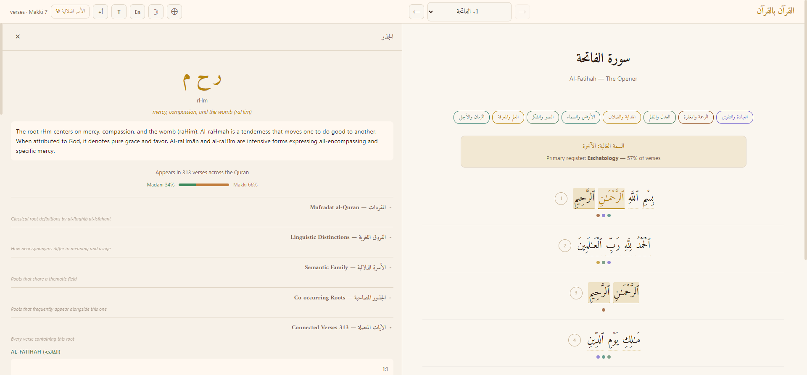
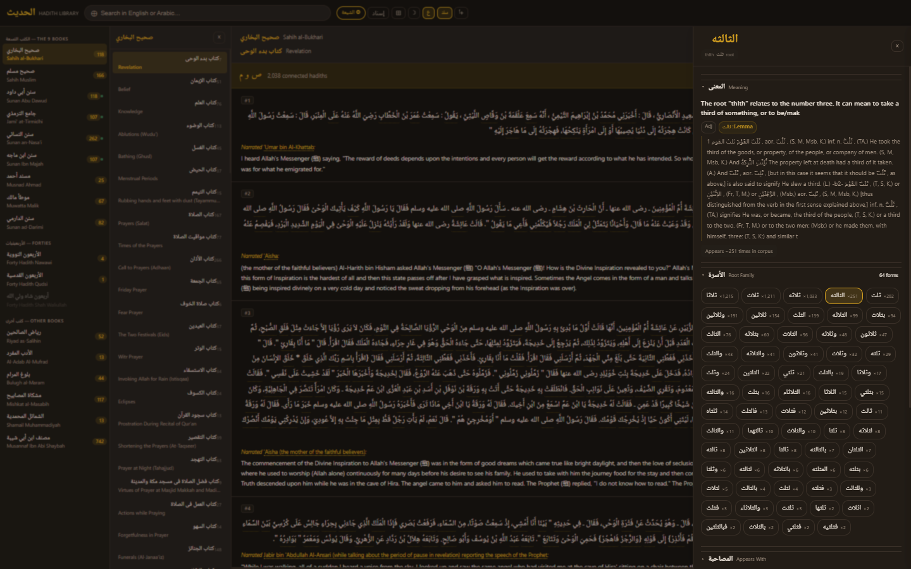
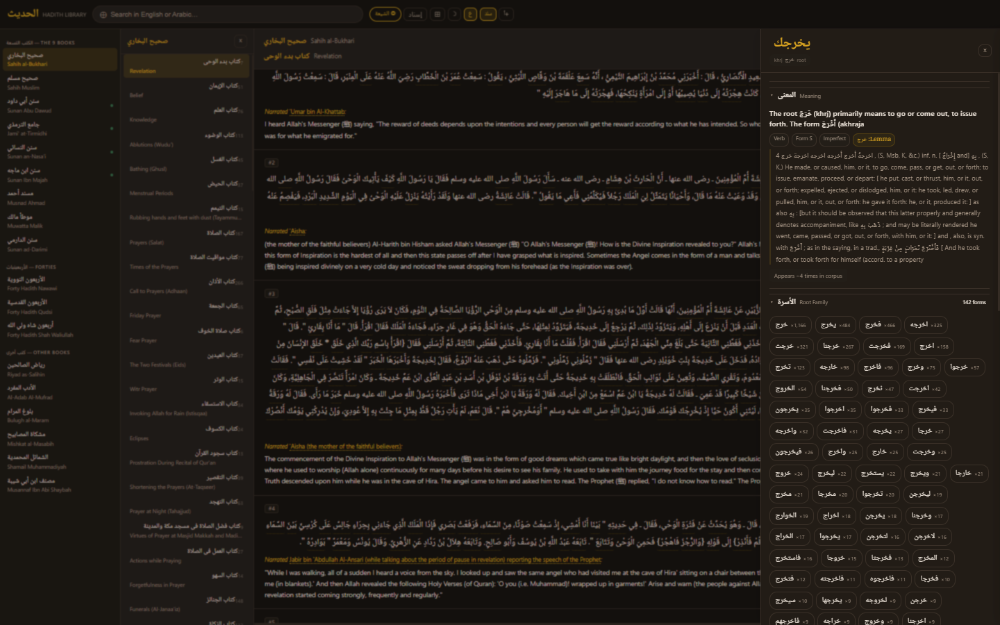
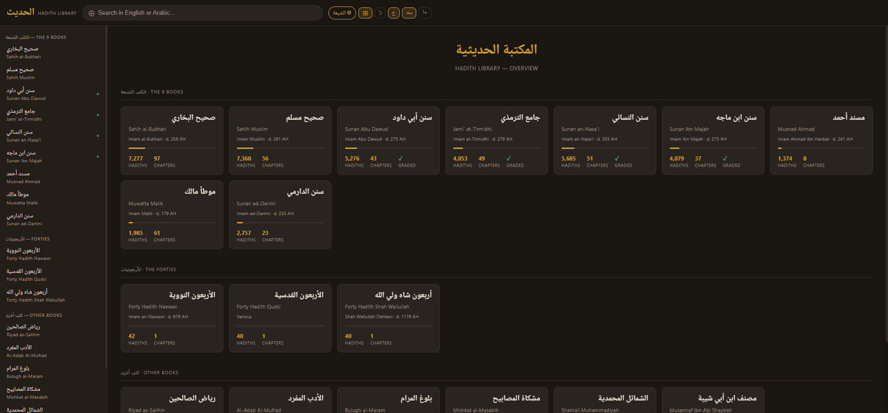
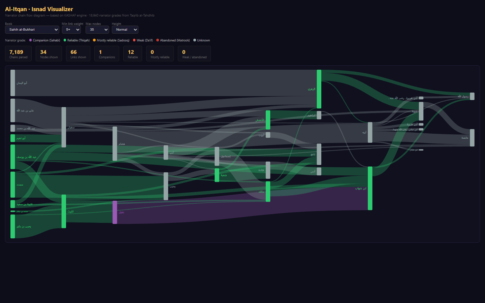

# Itqan (الإتقان) — Computational Quran–Hadith Concordance & Rijal Database

[](https://doi.org/10.5281/zenodo.19453612)
[](https://doi.org/10.5281/zenodo.19453613)

**Researched, compiled & developed by [Ali Bin Shahid](https://www.linkedin.com/in/alibinshahid/)**

> *"Itqan"* (إتقان) means mastery, perfection, and precision in craft. This project applies that principle to Islamic source texts: the first open-source computational concordance connecting the Quran and the complete Hadith corpus through Arabic root morphology, paired with the largest structured narrator database (ilm al-rijal) available in JSON format.

### By the Numbers

| | Metric | Scale |
|---|--------|-------|
| 📚 | **Hadith corpus** | 112,221 hadiths across 18 Sunni books + 15,000+ Shia |
| 🔗 | **Root bridge** | 1,336 shared Arabic roots generating 1,326,229 Quran↔Hadith links |
| 📖 | **Quran coverage** | 6,236 ayahs, 1,651 unique roots, 39 thematic families |
| 👤 | **Narrator database** | 18,298 narrators with 72,767 name variants, jarh wa ta'dil from 6+ classical scholars |
| 🔍 | **Morphological dictionary** | 32,413 Arabic words → root + Lane's Lexicon + grammatical form |
| 📊 | **Isnad chains** | 100,000+ parsed transmission chains across 11 books, kunya resolution, grade matching |
| 🤖 | **AI layer** | FAISS semantic search (112k vectors) + RAG Q&A (Qwen2.5) on HuggingFace |

**[Live App](https://r3genesi5.github.io/Itqan/)** · **[Itqan AI](https://huggingface.co/spaces/iqrossed/al-itqan-rag)** · **[Paper](https://doi.org/10.5281/zenodo.19453612)** · **[How It Works](https://r3genesi5.github.io/Itqan/guide.html)**

---

## What This Is

Existing Quran and Hadith platforms (Quran.com, Sunnah.com, islamweb.net) provide text search on translations. Al-Itqan operates at the level classical scholars worked: **Arabic root morphology**. The root `صوم` connects every Quran verse about fasting to every hadith whose Arabic text contains a word derived from that root — whether the word is `صيام`, `يصوم`, `الصائم`, `صُمْتُ`, or `صوموا`. One root, all its forms, across both corpora at once.

Beyond the concordance, Itqan provides the **first structured JSON database of ilm al-rijal** (narrator criticism): 18,298 narrators with grades from Ibn Hajar and al-Dhahabi, jarh wa ta'dil opinions from Abu Hatim, Ahmad ibn Hanbal, and Ibn Hibban, and a kunya→real name mapping that resolves أبو هريرة to عبد الرحمن بن صخر الدوسي.

The result is a set of open JSON files that any developer or researcher can load and build on, plus a live web app that uses them.

| Quran bil-Quran — root panel | Hadith Reader — root filter mode |
|---|---|
|  |  |

| Hadith Reader — word definition panel | Library map — all 18 books |
|---|---|
|  |  |

**Corpus:** 112,221 Sunni hadiths + standalone Shia database
**Quran roots:** 1,651 unique roots, 6,236 ayahs
**Cross-references:** 1,326,229 Quran↔Hadith root links through 1,336 shared roots
**Thematic families:** 39 (35 classical + 4 new: End of Times, Jihad, Statecraft, Family Law)

### Getting Started

```bash
git clone https://github.com/R3GENESI5/hadith.git
cd hadith
# Open quran/index.html in any browser — that's it.
```

No build step, no server, no dependencies. Everything is static HTML + JSON.

---

## What's Original in Itqan

Itqan builds on three open-source projects (KASHAF, BasilSuhail, HadithRAG) — but the source projects provided **concepts**. The vast majority of Itqan is new work that did not exist anywhere before.

### Extended from source projects

| Source | What it was | What Itqan made it |
|--------|------------|-------------------|
| **KASHAF** | Bukhari-only CSV, Google Charts | **11 books**, D3-sankey, 100,656 parsed chains, narrator grading from Taqrib al-Tahdhib, interactive controls |
| **BasilSuhail** | 15k hadiths, English-only model | **112,221 hadiths**, `multilingual-e5-small` (Arabic-native), root family tagging, HuggingFace deployment |
| **HadithRAG** | GPT-3.5 (paid), no grounding | **Qwen2.5** (open-source, free), multi-turn conversation, source citations, deduplication |

### Entirely original — built from scratch

These components have no precedent in any of the source projects or, to our knowledge, in any open-source Islamic studies tool:

| Component | What it does | Scale |
|-----------|-------------|-------|
| **Quran↔Hadith root bridge** | Connects every Quran root to every hadith containing a word from that root | 1,336 roots, 1,326,229 links |
| **39 thematic families** | Roots grouped by semantic field (mercy, justice, prayer, trade...) from classical lexicography | 39 families spanning both corpora |
| **Word-level morphological definitions** | Click any Arabic word in any hadith → root, Lane's Lexicon definition, morphological form | 32,413 words across 112k hadiths |
| **Mufradat al-Quran integration** | Al-Raghib al-Isfahani's classical root definitions in the Quran reader | 1,651 roots |
| **Concordance (Mu'jam al-Mufahris)** | Full inverted index: every word → every hadith containing it | 32,410 words, 1.15M entries |
| **Chord visualizations** | Family×Family overlap, book distinctiveness, narrator×book network | 3 interactive D3 diagrams |
| **Root alias map** | Reconciles CAMeL Tools and Quran root forms for Arabic NLP edge cases | 131 entries, recovering 4,977 mappings |
| **How It Works guide** | Visual walkthrough with SVG flow diagram and interpretive data insights | 6-step Quran-first discovery flow |
| **Unified rijal database** | 18,298 narrator profiles with grades, kunya, jarh wa ta'dil merged from 3 sources | 72,767 name variants, 701 with full scholar opinions |
| **Isnad parsing pipeline** | Chain extraction with father/grandfather resolution, kunya repair, honorific deduplication | 100k+ chains, 37-entry genealogy lookup, 32 kunya mappings |
| **Musnad Ahmad expansion** | Full Arnaut edition (26,539 hadiths) parsed from OpenITI — 2nd largest book in the corpus | Was 1,374 from sunnah.com |

The data pipeline, the root bridge, the families, the word panel, the concordance, the chord graphs, the rijal database, the isnad parsing, the guide, and the interpretive annotations — all of this is new.

---

## How It Works

Open `quran/index.html` — that's the entry point. Every Quran verse has root dots under each word. Click any root and a side panel opens with:

- **Root meaning** — al-Raghib al-Isfahani's *Mufradat Alfaz al-Quran* (d. 1108 CE)
- **Linguistic distinctions** — *Furuq* (الفروق): precise semantic differences between near-synonyms
- **Semantic families** — which of the 39 thematic families this root belongs to
- **Connected Quran verses** — every ayah sharing this root
- **Connected hadiths** — per-book counts with a link to browse them

Click a hadith book badge and Itqan opens the hadith view filtered to that root — showing only hadiths whose Arabic text contains a word from the same root, across 18 Sunni books plus a standalone Shia collection. The hadith view also works standalone: browse by book and chapter, full-text search, grade badges (Sahih/Hasan/Da'if), and word-level morphological definitions.

**v1.1:** Opening the hadith view with a root filter now shows connected Quran verses for that root (reverse bridge), linking back to the Quran view. Hadiths are shareable via deep-link URLs (`#bukhari/0/3`), and a new Thematic Families page lets users browse all 39 semantic families with expandable root chips.

### Itqan AI — Optional Companion

**[Itqan AI on HuggingFace](https://huggingface.co/spaces/iqrossed/al-itqan-rag)** — concordance search (Arabic morphological lookup or English semantic search) and RAG-powered Q&A over the full 112k hadith corpus. Not required for the core study workflow.

---

## The Data Pipeline

```
RAW HADITH TEXT (Arabic, 18 books, 112,221 hadiths)
        │
        ▼
  CAMeL Tools — Cairo Arabic NLP Toolkit
  Morphological analyzer (MSA + Classical Arabic)
  For every word: root, lemma, POS, verb form (I–X), voice, aspect
        │
        ▼
  word_defs_v2.json                   32,413 Arabic words → root assignments
        │
  + patch_word_defs.py                Manual fixes for CAMeL Tools gaps:
    • يوم (day/Qiyama) — 14 forms added (was completely absent)
    • أمر (command/authority) — 30 forms added
    • ولي (guardian/wilaya) — 22 forms added
    • أرض (earth) — 13 forms added
    • وقي (taqwa/piety) — 19 forms added
    • فتن (fitnah) — 5 wrong root assignments fixed (فوت→فتن)
    • أمن (faith/iman) — alias added (CAMeL uses ومن form)
        │
        ▼
  concordance.json                    Inverted index (Mu'jam al-Mufahris)
  Every Arabic word → list of hadith IDs that contain it
  32,410 words · 1,149,723 total entries · cap 2,000 per word
        │
        │          Quran roots_index.json   (1,651 roots + ayah lists)
        │          families.json            (39 thematic families → roots)
        │          mufradat.json            (Raghib al-Isfahani lexicon)
        │          roots_lexicon.json       (Lane's Lexicon)
        │          root_alias_map.json      (131 CAMeL↔Quran form fixes)
        │
        ▼
  build_bridge.py
  For each Quran root → find all hadith words with that root (via alias map)
  → look up each word in concordance → collect all hadith IDs
        │
        ▼
  quran_hadith_bridge.json            1,651 roots fully connected
  1,326,229 total Quran↔Hadith root links
        │
        ▼
  family_corpus.json                  39 thematic families
  Each family: all reachable hadiths across all 18 books,
  ayah list, root stats, book breakdown
```

### Root Canonicalization: The Hidden Problem

CAMeL Tools and the Quran roots index use different canonical forms for the same root. This is a known NLP challenge with Arabic:

| Root concept | Quran form | CAMeL form | Type |
|---|---|---|---|
| judgment/judiciary | قضي | قضو | Defective verb (ي→و) |
| pledge/sale | بيع | بوع | Hollow verb (middle ي→و) |
| faith/belief | أمن | ومن | Hamza normalization |
| guide | هدي | هدو | Defective verb |

**Fix:** `src/root_alias_map.json` — 131 entries mapping Quran root forms to CAMeL canonical forms. `build_bridge.py` applies this map before looking up words, recovering **4,977 additional word→root mappings**.

---

## The JSON Files

### `word_defs_v2.json` (6.7 MB)

The morphological dictionary. Every significant Arabic word in the corpus mapped to its root and definition.

```json
"صلي": {
  "r":   "صلو",
  "g":   "to pray, perform the ritual prayer",
  "d":   "Lane's Lexicon full definition (truncated to 500 chars)...",
  "n":   2847,
  "lem": "صلى",
  "pos": "verb",
  "form": "I"
}
```

| Field | Meaning |
|---|---|
| `r` | Arabic root (CAMeL canonical form) |
| `g` | Short gloss |
| `d` | Lane's Lexicon definition |
| `n` | Corpus frequency (how many hadiths contain this word) |
| `lem` | Lemma (base form) |
| `pos` | Part of speech |
| `form` | Verb form I–X (if verb) |
| `_patched` | `true` if added by patch script, not CAMeL |

**Power:** Any Arabic word in any hadith is one lookup away from its root, grammar, and classical definition. Foundation of the word panel, root navigation, and cross-reference features.

---

### `concordance.json` (22 MB)

The **Mu'jam al-Mufahris** — the classical concordance index. Medieval scholars like Fuad Abd al-Baqi spent decades compiling this by hand. Here it is computed.

```json
"صلاه":  ["bukhari:1:2",   "muslim:0:5",   "abudawud:3:12",  ...],
"يوم":   ["bukhari:0:1",   "musannaf_ibnabi_shaybah:5:47", ...],
"تقوي":  ["tirmidhi:2:4",  "bukhari:65:51", ...]
```

- **32,410 words** indexed
- **1,149,723 total entries** (word × hadith pairs)
- Cap of **2,000 hadith IDs per word** (prevents ultra-common words from dominating)
- IDs format: `book_id:chapter_index:hadith_id_in_chapter` (3-part, chapter-aware — fixed from the original 2-part format where `idInBook` restarted per chapter causing false matches)

**Power:** Click any Arabic word in the reader → instantly retrieve every hadith in the corpus that contains it, across all 18 books. Full-text search with zero search engine infrastructure.

---

### `quran_hadith_bridge.json` (21 MB)

The core innovation. Every Quran root connected to its hadiths, with classical definitions from two sources.

```json
"صوم": {
  "ayahs":         ["2:183", "2:184", "2:185", "2:187", ...],
  "ayah_count":    14,
  "hadith_ids":    ["bukhari:1771", "muslim:2502", "nasai:2106", ...],
  "hadith_count":  892,
  "book_breakdown": {
    "musannaf_ibnabi_shaybah": 312,
    "bukhari": 124,
    "muslim":  98,
    "nasai":   87
  },
  "words_in_hadith": ["صوم", "صيام", "يصوم", "الصائم", "صوموا", ...],
  "families":      ["worship", "purity"],
  "definitions": {
    "quran_meaning": "fasting, abstaining from food and desire",
    "mufradat":      "Raghib al-Isfahani: صوم means to restrain oneself...",
    "lanes":         "Lane's Lexicon: the act of abstaining from food..."
  },
  "frequency_quran": 14
}
```

| Field | Meaning |
|---|---|
| `ayahs` | All Quran verse references containing this root |
| `hadith_ids` | All hadith IDs whose Arabic text contains a word from this root |
| `book_breakdown` | Per-book count of matched hadiths |
| `words_in_hadith` | The actual Arabic word forms found in the corpus |
| `families` | Which thematic families this root belongs to |
| `definitions.mufradat` | Classical definition from Raghib al-Isfahani (d. 1108 CE) |
| `definitions.lanes` | Definition from Edward William Lane's Arabic–English Lexicon |

**Power:** Open any Quran ayah → surface every related hadith. Open any hadith → see which Quranic roots its vocabulary maps to. The cross-reference layer that no existing open-source Quran/Hadith app has at this depth.

---

### `family_corpus.json` (12.6 MB)

39 thematic families, each a pre-curated corpus spanning both Quran and Hadith.

```json
"end_of_times": {
  "name_ar":     "أشراط الساعة والأخروية",
  "meaning":     "Signs of the Hour, eschatology, resurrection, grave, trials before the Day of Judgment",
  "roots":       ["فتن", "قوم", "بعث", "حشر", "نفخ", "قبر", "موت", "روح", ...],
  "root_count":  24,
  "ayah_count":  1388,
  "hadith_count": 14572,
  "hadith_ids":  [...],
  "book_breakdown": {
    "musannaf_ibnabi_shaybah": 4821,
    "bukhari": 621,
    "muslim":  534
  },
  "root_stats": [
    {"root": "فتن", "ayah_count": 58,  "hadith_count": 360},
    {"root": "قوم", "ayah_count": 70,  "hadith_count": 2140},
    {"root": "بعث", "ayah_count": 67,  "hadith_count": 890}
  ]
}
```

**The 39 families:**

| Family | Ayahs | Hadiths | Notes |
|---|---|---|---|
| movement_journey | 2,550 | 23,934 | Travel, migration, Hajj |
| worship | 2,748 | 22,596 | Prayer, fasting, zakat, Hajj |
| body | 1,131 | 22,037 | Purity, medicine, physical acts |
| speech_communication | 2,083 | 19,808 | Truthfulness, oaths, rhetoric |
| provision | 1,208 | 18,255 | Wealth, trade, sustenance |
| fighting | 706 | 15,947 | Battle, defense, weapons |
| time | 1,408 | 15,540 | Days, seasons, sacred times |
| knowledge | 2,163 | 15,370 | Learning, teaching, scholarship |
| earth_sky | 1,380 | 15,184 | Cosmology, nature, agriculture |
| life_death | 1,079 | 14,795 | Soul, death, afterlife |
| **end_of_times** ★ | 1,388 | 14,572 | Eschatology, Dajjal, signs of Hour |
| wealth | 449 | 14,447 | Inheritance, charity, economics |
| **statecraft** ★ | 1,914 | 13,624 | Caliphate, governance, bay'a |
| **family_law** ★ | 741 | 13,576 | Marriage, divorce, inheritance |
| creation | 2,437 | 13,553 | Origins, cosmogony |
| justice | 2,071 | 12,795 | Courts, equity, rights |
| ... | | | |
| **jihad** ★ | 708 | 11,291 | Striving, martyrdom, conquest |
| ... | | | |
| deception_hypocrisy | 354 | 3,479 | Nifaq, lying, betrayal |

★ = new families added in this project

**Power:** A researcher studying eschatology calls `family_corpus["end_of_times"].hadith_ids` and gets 14,572 pre-identified hadiths across 18 books, cross-referenced to 1,388 Quran ayahs, broken down by root — without writing a single database query.

---

### `narrator_index.json` (0.6 MB)

Every narrator name found in the corpus, with hadith counts and book distribution.

```json
"أبو هريرة": {
  "total": 5374,
  "books": {
    "bukhari": 446,
    "muslim":  618,
    "abudawud": 977
  },
  "grade": "thiqah"
}
```

**Power:** Foundation for the isnad visualizer. Any narrator → their full transmission record across all 18 books.

---

### `hadith_connections.json` (4.2 MB)

Cross-book connections: hadiths that share matn (text), topic, or ruling pattern.

```json
"bukhari:1": {
  "connected": [
    {"id": "muslim:1907", "type": "shared_matn",  "score": 0.94},
    {"id": "nasai:75",    "type": "shared_ruling", "score": 0.71}
  ]
}
```

**Power:** "See also" links across books. When a user reads Bukhari:1, they can navigate to the same hadith in Muslim, Nasa'i, and other books instantly.

---

### Supporting files

| File | Size | Contents |
|---|---|---|
| `roots_lexicon.json` | 1.5 MB | 1,651 roots → Lane's Lexicon full definitions |
| `src/root_alias_map.json` | 2 KB | 131 CAMeL↔Quran root form corrections |
| `src/bridge_analysis.json` | 48 KB | Cross-correlation stats, rank comparisons, top ayahs |
| `app/chord_matrices.json` | 13 KB | Pre-computed 39×39 overlap matrix for chord graphs |

---

## The Chord Graphs

`app/chord.html` — a self-contained interactive visualization with three tabs (no server needed, data embedded inline, D3.js v7.9.0).

### Tab 1: Family × Family Overlap

A chord diagram with 39 arcs (one per thematic family). The width of each chord between two arcs equals the number of hadiths that belong to **both** families simultaneously.

**What it reveals:**

- **worship ↔ movement_journey** — thick chord: prayer hadiths reference prostration, standing, and travel to the mosque; pilgrimage hadiths reference prayer at every station
- **statecraft ↔ justice** — thick chord: Islamic governance and judicial fairness are treated as inseparable in hadith literature
- **end_of_times ↔ life_death** — expected overlap: resurrection, the grave, and the soul sit in both families
- **family_law ↔ provision** — thick chord: marriage contracts, mahr, and nafaqa (maintenance) are economic as much as personal
- **jihad ↔ fighting** — overlapping but distinct: jihad roots (جهد, شهد, غزو) are more specific than the broader fighting family (حرب, قتل, سلح)

**Interaction:** hover any arc → see its total hadith count and top 4 overlapping families. Click to isolate all its chords. Click background to reset.

### Tab 2: Book Distinctiveness — "What makes each book unique?"

A sparse bipartite chord: 18 books (blue) × 15 families (orange). Unlike the old fully-connected Book × Family view (which was informationally empty — every book linked to every family with similar proportions), this shows only **over-represented** connections: where a book's coverage of a family **exceeds the corpus average** by >12%.

Only 30 ribbons are drawn (vs 270 in a fully-connected view). Each chord's width = **excess hadiths above expected** for that family.

**What it reveals:**

- **Musannaf Ibn Abi Shaybah → Fighting** (+2,168 excess hadiths) — the largest single signal; Musannaf is distinctly martial compared to the corpus average
- **Tirmidhi → Knowledge** (+650) and **Earth & Sky** (+541) — Tirmidhi leans heavily into scholarly and cosmological hadiths
- **Ibn Majah → Provision** (+591) and **Time** (+413) — commercial and temporal themes are over-represented
- **Darimi → Body** (+373) and **Family Law** (+211) — physical practice and family jurisprudence
- **Bukhari → Earth & Sky** (+529) — cosmological hadiths are proportionally high
- **Malik → Family Law** (+145) — the Muwatta's legal character shows clearly

### Tab 3: Narrator × Book — The Transmission Network

A bipartite chord: 20 major Sahaba/narrators (green) × 18 books (blue). Shows which narrators dominate which books — the actual hadith transmission structure.

Narrator names are normalized from 1,422 raw variant strings (e.g. "Abu Huraira", "Abu Hurairah", "AbuHurayrah", "It was narrated that Abu Hurairah said") into 20 canonical names using regex-based transliteration canonicalization.

**What it reveals:**

- **Abu Hurayra** dominates across all major books: Ahmad (2,724), Muslim (882), Bukhari (662)
- **Ali ibn Abi Talib** clusters heavily in Ahmad — reflecting Ahmad ibn Hanbal's Kufan sources
- **Aisha** (2,155) has strong presence in Bukhari (645), Nasa'i (393), and Muslim (336)
- **Anas ibn Malik** (1,926) is remarkably evenly distributed across 12 books
- **Small collections** (Nawawi 40, Qudsi 40, Shah Waliullah 40) have zero or near-zero narrator connections — these are curated anthologies, not narrated collections

---

## The Concordance Audit Dashboard

`app/concordance_audit.html` — a Chart.js verification dashboard used during development.


*Five-chart data quality dashboard: family coverage, top roots, per-book indexing, word frequency, and Quran↔Hadith correlation*

Five charts:
1. **39 families bar chart** — hadith coverage per family, new families highlighted in red
2. **Top 40 roots** — hadith count vs ayah count side by side; shows which roots are over/under-represented between the two corpora
3. **Per-book coverage** — total hadiths vs concordance entries per book; verifies every book is indexed
4. **Word frequency distribution** — histogram of how many words appear in 1–4 hadiths vs 5–19 vs ... vs 2000 (cap). Most words are rare; ~81 words hit the 2000 cap including صلي, قال, كان
5. **Quran freq vs Hadith count scatter** — hover any dot to see root + meaning. Shows rough positive correlation but interesting outliers: roots frequent in Quran but rare in Hadith (abstract theological), and roots rare in Quran but very frequent in Hadith (legal practice detail)

---

## The Isnad Visualizer

`app/isnad.html` — a D3-sankey flow diagram showing how hadiths were transmitted from the Prophet ﷺ through generations of narrators to the book compilers.


*Sahih al-Bukhari: 7,189 chains parsed, 34 nodes shown, colored by narrator grade (green = Reliable/ثقة, grey = Unknown)*

### How to read the diagram

In hadith science (*mustalah al-hadith*), every hadith has an **isnad** (إسناد) — a chain of narrators (*ruwat*, singular *rawi* راوي) who transmitted the hadith from the Prophet ﷺ down to the compiler of the book. The isnad is what hadith scholars use to judge whether a hadith is authentic: a chain of trustworthy narrators with unbroken links = *sahih*; a chain with a weak or missing narrator = grounds for downgrading.

This diagram visualizes those chains as a Sankey flow:

- **Each vertical bar is a rawi (راوي)** — a narrator in the chain. The bar's height reflects how many chains (*asanid*) pass through that rawi. A tall bar like al-Zuhri (الزهري) means he appears in hundreds of chains for that book — he is a major hub of transmission. The Prophet ﷺ (*rasul Allah*) and the Sahaba (أبو هريرة، ابن عباس، عائشة) appear on the right; later *tabi'in* (successors), *atba' al-tabi'in* (followers of successors), and the book's *musannif* (compiler) appear progressively to the left.
- **Each flowing band is a riwaya (رواية)** — a transmission link between two narrators. A band from rawi A to rawi B means "A heard from B and transmitted to others." The width = how many chains share that link. Hover to see the count (e.g. "Sufyan → al-Zuhri — 58 transmissions"). A thick band between two narrators indicates a well-established *tariq* (طريق) — a major transmission route.
- **Color = the rawi's grade from *ilm al-rijal*** (علم الرجال — the science of narrator criticism), sourced from the KASHAF database (18,940 entries from Ibn Hajar's *Taqrib al-Tahdhib*):

  | Color | Grade | Arabic | Meaning |
  |---|---|---|---|
  | **Purple** | Sahabi (صحابي) | صحابي | Companion — met the Prophet ﷺ directly |
  | **Green** | Thiqah (ثقة) | ثقة | Trustworthy — hadith accepted without reservation |
  | **Amber** | Sadooq (صدوق) | صدوق | Truthful — acceptable, minor reservations |
  | **Red** | Da'if (ضعيف) | ضعيف | Weak — hadith through this rawi are questioned |
  | **Dark red** | Matrook (متروك) | متروك | Abandoned — severely weak, hadith rejected |
  | **Grey** | Unknown | مجهول | Not yet matched to the grade database |

- **Flow direction** is right-to-left (matching Arabic reading order): the Prophet ﷺ on the far right → Sahaba → Tabi'in → later scholars → the book's compiler on the far left. This mirrors how scholars write an isnad: they start with the compiler and trace back to the Prophet ﷺ, but the diagram shows the *origin* of knowledge (the Prophet) flowing outward through generations.

### Controls

| Control | What it does |
|---|---|
| **Book** | Switch between 11 hadith books — each book has a different narrator network reflecting its compiler's sources and geographic tradition |
| **Min link weight** | Filter out infrequent transmission routes (2+, 5+, 10+, 20+, 50+). Higher values show only the most established *turuq* (routes) |
| **Max nodes** | Limit how many ruwat appear (20, 35, 50, 60). Lower = only the most prolific narrators, giving a clearer view of the book's primary transmission structure |
| **Height** | Diagram height (Compact, Normal, Tall, Full) — use Tall/Full for dense books like Musannaf Ibn Abi Shaybah |

### Stats bar

The stats bar shows: total *asanid* (chains) parsed from the book, ruwat and links currently displayed, and a grade breakdown — how many visible narrators are Sahaba, Thiqah, Sadooq, or Da'if/Matrook.

### Narrator grade matching

Grades are matched from a unified database of **18,298 narrators** (72,767 name variants) compiled from three sources:

| Source | Narrators | What it provides |
|--------|-----------|-----------------|
| **KASHAF** (OmarShafie/hadith) | 17,093 | Base grades from Taqrib al-Tahdhib |
| **AR-Sanad 280K** (somaia02/Narrator-Disambiguation) | 18,298 | Full names, ALL name variants, Ibn Hajar rank, Dhahabi rank, kunya, death/birth year, city, tabaqat, teacher→student ID links |
| **hatemben/hadithdb** | 1,524 | Full jarh wa ta'dil (multiple scholar opinions: Abu Hatim, Ahmad ibn Hanbal, Ibn Hibban, etc.) |

Match rate per book after AR-Sanad integration:

| Book | Graded | Rate |
|------|--------|------|
| Bukhari | 37/60 | **61%** |
| Abu Dawud | 36/60 | **60%** |
| Ahmad | 32/60 | **53%** |
| Muslim | 30/60 | **50%** |

### Isnad chain parsing fixes

The isnad parser (`src/parse_isnad_chains.py`) handles several Arabic-specific challenges:

| Problem | What it is | How it's fixed |
|---------|-----------|---------------|
| **أبيه / أبي** | "his father" — relative reference, not a name | 37-entry father lookup table resolving to actual names (e.g., هشام بن عروة → عروة بن الزبير) |
| **جده** | "his grandfather" | 8-entry grandfather map (e.g., شعيب بن محمد → عبد الله بن عمرو) |
| **Broken kunyas** | `عن أبي صالح` split into `أبي` + `صالح` | Peek-ahead repair: if `أبي` is standalone, merge with next segment |
| **Honorific duplication** | `أبي هريرة` ≠ `أبي هريرة ـ رضى الله عنه ـ` | Strip رضى الله عنه, kashida (ـ), trailing قال |
| **عمي / أمه** | "my uncle" / "his mother" | Dropped (too ambiguous to resolve) |

### Kunya → real name tooltips

32 kunya narrators mapped to their real names for the isnad tooltip display:

| Kunya | Real name | English |
|-------|-----------|---------|
| أبو هريرة | عبد الرحمن بن صخر الدوسي | Abd al-Rahman ibn Sakhr al-Dawsi |
| أبو صالح | ذكوان السمان | Dhakwan al-Samman |
| أبي إسحاق | عمرو بن عبد الله السبيعي | Amr ibn Abdullah al-Sabi'i |
| أبو أسامة | حماد بن أسامة القرشي | Hammad ibn Usama al-Qurashi |
| أبو معاوية | محمد بن خازم الضرير | Muhammad ibn Khazim al-Darir |
| ... | 27 more | See `src/isnad_kunya_map.json` |

---

## The Rijal Page — Narrator Profiles

`app/rijal.html` — a searchable browser for **18,298 narrator biographies** from the classical hadith tradition.

Every narrator who appears in the six canonical books (Kutub al-Sittah) and related collections is profiled with:

- **Full name** and all known **name variants** (e.g., أبو هريرة has 12+ variant spellings across manuscripts)
- **Kunya** (honorific patronymic), **laqab** (title), **nasab** (lineage), **nisba** (geographic/tribal affiliation)
- **Ibn Hajar's grade** from *Taqrib al-Tahdhib* — the standard one-line assessment (ثقة, صدوق, ضعيف, etc.)
- **Al-Dhahabi's assessment** — an independent second opinion
- **Jarh wa ta'dil** (701 narrators) — the full critical opinions from multiple classical scholars: Abu Hatim al-Razi, Ahmad ibn Hanbal, Ibn Hibban, Ibn 'Adi, al-Nasa'i, etc. This is the raw material that hadith scholars use to evaluate narrator reliability.
- **Death year**, **birth year**, **city of residence**, **tabaqat** (generation in the chain of transmission)

### Data sources

The unified narrator database (`app/data/narrator_unified.json`, 30 MB) merges three open-source datasets:

1. **AR-Sanad 280K** (somaia02) — 18,298 narrators with 72,767 name variants and teacher→student ID links. This is the largest structured dataset of hadith narrators available.
2. **hatemben/hadithdb** — 1,524 Bukhari narrators with detailed jarh wa ta'dil from Tahdhib al-Tahdhib (multiple scholar opinions per narrator, with source references to specific pages in classical texts).
3. **KASHAF** (OmarShafie/hadith) — 17,093 entries with grades extracted from Tahdhib al-Tahdhib.

### Interaction

- **Search** by name, kunya, or city in Arabic or English
- **Filter** by grade (Companion, Reliable, Weak, etc.) or generation (tabaqat)
- **Click any card** to expand: name variants, laqab, nasab, and full jarh wa ta'dil opinions

---

## The AI Layer — Three Integrated Engines

This repo contains the **data layer** that powers Al-Itqan. Three open-source tools form the **AI layer**, running on HuggingFace Spaces as optional APIs on top of the fully-static core.

| Engine | Space | Status |
|--------|-------|--------|
| KASHAF — Isnad Visualizer | (local, `app/isnad.html`) | ✅ Integrated |
| BasilSuhail — Semantic Search | [iqrossed/al-itqan-search](https://huggingface.co/spaces/iqrossed/al-itqan-search) | ✅ Deployed |
| HadithRAG — Conversational Q&A | [iqrossed/al-itqan-rag](https://huggingface.co/spaces/iqrossed/al-itqan-rag) | ✅ Deployed |

The FAISS semantic index (112,221 hadiths, `intfloat/multilingual-e5-small`, 276MB) is hosted at [`iqrossed/al-itqan-index`](https://huggingface.co/datasets/iqrossed/al-itqan-index) and shared by both Spaces.

### KASHAF — Isnad Visualizer
**Source:** `github.com/OmarShafie/hadith`
**What it is:** A Sankey/flow diagram that shows how a hadith was transmitted: narrator A → narrator B → narrator C → the Prophet (ﷺ). Built with Papa Parse + PEG.js for parsing chains, Google Charts for the Sankey.
**Current state:** Works only for Bukhari, loads a static CSV, uses Google Charts (requires internet).
**What Al-Itqan takes:**
- The Sankey data model: `[source_narrator, target_narrator, hadith_count]` rows
- The narrator reliability color-coding logic (thiqah = green, da'if = red, unknown = grey)

**What Al-Itqan changes:**
- Google Charts → **D3-sankey** (MIT, self-hosted, offline-capable)
- Bukhari-only CSV → `isnad_graph.json` across **all 11 books** (100,656 parsed chains)
- Static CSV → dynamic: user selects book, min link weight, max nodes, height
- Narrator nodes color-coded by grade: companion (purple), reliable (green), mostly reliable (amber), weak (red), abandoned (dark red), unknown (grey)
- Arabic fuzzy name matching (`src/match_narrator_grades.py`) links short isnad names (الزهري, شعبة, مالك) to KASHAF full biographical entries via 5-strategy cascade + manual aliases

**Status:** ✅ Complete — `app/isnad.html`, `app/data/isnad_graph.json`, `src/parse_isnad_chains.py`, `src/match_narrator_grades.py`

---

### BasilSuhail — Semantic Search
**Source:** `github.com/BasilSuhail/Quran-Hadith-Application-Database`
**What it is:** A Flask app using FAISS (Facebook AI Similarity Search) + `all-MiniLM-L6-v2` sentence embeddings to do semantic search over a ~15k hadith subset. Type "forgiveness of sins" → get the most semantically similar hadiths even if the exact words don't match.
**Current state:** Works but uses an English-first embedding model on Arabic text, covers only ~15k hadiths, runs as a local Flask server.
**What Al-Itqan takes:**
- The two-corpus unified search concept (Quran + Hadith in one query)
- The FAISS nearest-neighbor retrieval pattern
- The result schema: `{type, text, reference, score}`

**What Al-Itqan upgrades:**
- 15k hadiths → **112,221 hadiths** (all 18 books)
- `all-MiniLM-L6-v2` (English-first, no Arabic understanding) → **`intfloat/multilingual-e5-small`** (instruction-tuned multilingual, Apache-2.0)
- Flask local server → **HuggingFace Spaces** (Gradio, CPU-only, free)
- No context → **every result tagged with root family** from `quran_hadith_bridge.json`

**Quantitative benchmark** (`src/compare_embeddings.py`, 10,000-hadith proportional sample, 12 Arabic queries):

| Metric | multilingual-e5-small | all-MiniLM-L6-v2 |
|---|---|---|
| Avg top-1 cosine similarity | **0.871** | 0.748 |
| Query wins | **12 / 12** | 0 / 12 |
| Result overlap @ 5 | — | 0.0 (no shared results) |

MiniLM returned the same 2–3 hadiths for completely unrelated queries (jihad, knowledge, death) — confirming it has no Arabic semantic understanding. Full results: `src/embedding_comparison.json`.

**Pre-computation pipeline** (`src/build_semantic_index.py`):
1. Embed each hadith's Arabic matn with `passage: ` prefix (e5-small instruction format)
2. L2-normalize → FAISS IndexFlatIP (cosine similarity)
3. Save: `app/data/semantic/semantic_index.faiss` + `semantic_meta.json` (216 MB, hosted at `iqrossed/al-itqan-index`)
4. Deploy on HuggingFace Space

**Status:** ✅ Complete — `app/data/semantic/`, `hf_spaces/search/`, deployed at `iqrossed/al-itqan-search`

---

### HadithRAG — Conversational Q&A
**Source:** `github.com/Quchluk/HadithRAG`
**What it is:** A RAG (Retrieval-Augmented Generation) pipeline using ChromaDB + a language model. Ask a question → retrieve relevant hadiths from vector store → generate a cited answer. The key innovation in HadithRAG is storing the full isnad (chain of narration) in the vector metadata, so the LLM can include the chain in its answer.
**Current state:** Prototype with a small corpus, ChromaDB, and GPT-4 as the generator.
**What Al-Itqan takes:**
- The isnad-preserving schema: full chain text stored in vector metadata, not stripped out
- The retrieval loop: query → top-K hadiths → LLM generates answer with citations

**What Al-Itqan upgrades:**

| Feature | Original HadithRAG | Al-Itqan |
|---|---|---|
| Vector store | ChromaDB | FAISS (reuses exact same index as search — no duplication) |
| Generator | OpenAI GPT-3.5 (paid, closed) | Qwen2.5-0.5B-Instruct (Apache-2.0, free, runs on CPU) |
| Language | English only | Arabic + English — system prompt adapts to query language |
| Source grounding | None | Answers cite book name + hadith number explicitly |
| Hallucination protection | None | Model instructed: "answer ONLY from the provided hadiths" |
| Thematic context | None | Root family tags injected into every retrieved hadith block |
| Conversation | Single-turn | Multi-turn: `gr.State` tracks full session history |
| Deduplication | None | Seen-set prevents same hadith appearing twice in top-K |

The model, vector store, language support, grounding, and conversation architecture are all new. The RAG concept (retrieve → generate with citations) is taken from HadithRAG.

**Status:** ✅ Complete — `hf_spaces/rag/`, deployed at `iqrossed/al-itqan-rag`

---

## Architecture

```
┌─────────────────────────────────────────────────────────────┐
│                    ITQAN  (static, offline-capable)           │
│                                                              │
│  ┌──────────────────────────────────────────────────────┐   │
│  │  QURAN VIEW  (quran/index.html — entry point)        │   │
│  │  Click any root → side panel:                         │   │
│  │   • Mufradat definition  • Furuq distinctions         │   │
│  │   • Semantic families    • Connected verses            │   │
│  │   • Connected hadiths + per-book counts               │   │
│  │                     │                                  │   │
│  │              click hadith badge                        │   │
│  │                     ▼                                  │   │
│  │  HADITH VIEW  (app/index.html)                        │   │
│  │  112k hadiths · 18 books · grade badges                │   │
│  │  Root filter mode (?root=X) or standalone browse      │   │
│  │  Word panel: root, morphology, Lane's Lexicon         │   │
│  └──────────────────────────────────────────────────────┘   │
│                                                              │
│  ┌──────────────────────────────────────────────────────┐   │
│  │  ISNAD VISUALIZER  (D3 Sankey, 11 books, 100k chains)│   │
│  │  RIJAL PROFILES (18,298 narrators, jarh wa ta'dil)   │   │
│  │  CHORD GRAPHS · CONCORDANCE AUDIT · THEMATIC STUDY   │   │
│  └──────────────────────────────────────────────────────┘   │
│                                                              │
│  Data (lazy-loaded):                                         │
│    quran_hadith_bridge.json  21 MB · concordance.json 22 MB │
│    family_corpus.json 12.6 MB · Per-book hadith ~50 MB      │
└─────────────────────────────────────────────────────────────┘

┌─────────────────────────────────────────────────────────────┐
│            ITQAN AI  (HuggingFace — optional companion)      │
│                                                              │
│  Concordance search (Arabic morphological / English FAISS)  │
│  RAG Q&A: Qwen2.5-1.5B + FAISS retrieval, multi-turn       │
│  Every result tagged with family + root                      │
└─────────────────────────────────────────────────────────────┘
```

**Design principle:** Itqan works fully offline without AI. Itqan AI enhances but is never required. A user with no internet still gets the complete Quran-Hadith study workflow.

---

## Data Sources

### Hadith Books (Sunni — 112,221 hadiths)

| Book | Hadiths | Status |
|---|---|---|
| Sahih al-Bukhari | 7,277 | Graded (self-authenticated) |
| Sahih Muslim | 7,368 | Graded |
| Sunan Abu Dawud | 5,276 | Graded |
| Jami' at-Tirmidhi | 4,053 | Graded |
| Sunan an-Nasa'i | 5,685 | Graded |
| Sunan Ibn Majah | 4,079 | Graded |
| Musnad Ahmad | 26,539 | Arabic only (Arnaut edition via OpenITI) |
| Muwatta Malik | 1,985 | Ungraded |
| Sunan ad-Darimi | 2,757 | Ungraded |
| Riyad as-Salihin | 1,217 | Ungraded |
| Al-Adab Al-Mufrad | 1,326 | Ungraded |
| Bulugh al-Maram | 1,767 | Ungraded |
| Mishkat al-Masabih | 4,427 | Ungraded |
| Shamail Muhammadiyah | 400 | Ungraded |
| **Musannaf Ibn Abi Shaybah** | **37,943** | Ungraded (largest single book, 34% of corpus) |
| Nawawi 40 | 42 | Ungraded |
| Qudsi 40 | 40 | Ungraded |
| Shah Waliullah 40 | 40 | Ungraded |

**Shia:** 18 books, ~15,000+ hadiths — standalone searchable database (`app/shia.html`). Not connected to the root bridge or thematic families.

### Lexical Sources
- **Lane's Lexicon** — Edward William Lane, *Arabic-English Lexicon* (1863–1893). Public domain.
- **Mufradat** — Raghib al-Isfahani, *Mufradat Alfaz al-Quran* (d. 1108 CE). Classical Arabic lexicon specifically for Quranic vocabulary.
- **CAMeL Tools** — Cairo Arabic Morphological Analyzer (Arabic NLP toolkit, open-source, AUC Cairo). Used for root extraction.

---

## Repository Structure

```
Itqan/
├── quran/                        Quran view — entry point (open index.html)
│   ├── index.html                Root-based Quran reader
│   ├── themes.html               Thematic family explorer
│   ├── mushaf.html               Mushaf view
│   ├── js/app.js                 Quran logic + hadith bridge panel
│   ├── data/                     Surahs, roots, mufradat, furuq, translations, tafsirs
│   └── hadith-data/              Bridge summary for connected hadiths
│
├── app/                          Hadith view (linked from Quran, or standalone)
│   ├── index.html                Library map — all books with hadith counts
│   ├── hadith.html               Hadith reader with word panel
│   ├── shia.html                 Standalone Shia hadith database
│   ├── families.html             Thematic family browser (39 families, expandable root chips)
│   ├── rijal.html                Narrator profiles browser (18,298 narrators, jarh wa ta'dil)
│   ├── chord.html                Interactive chord graphs (3 tabs, data embedded)
│   ├── concordance_audit.html    Data quality verification dashboard
│   ├── css/
│   ├── js/
│   │   ├── app.js                Main reader logic
│   │   └── shia.js               Shia reader logic
│   └── data/
│       ├── quran_hadith_bridge.json    21 MB  — root bridge
│       ├── family_corpus.json         12.6 MB — 39 families
│       ├── concordance.json           22 MB   — inverted index
│       ├── word_defs_v2.json          6.7 MB  — morphological dictionary
│       ├── narrator_index.json        0.6 MB  — narrator records
│       ├── narrator_unified.json      30 MB   — 18,298 rijal profiles + jarh wa ta'dil
│       ├── hadith_connections.json    4.2 MB  — cross-book links
│       ├── roots_lexicon.json         1.5 MB  — Lane's definitions
│       ├── bridge_ids/                1,181 per-root JSON files {book:{ch:[ids]}}
│       ├── chord_matrices.json        13 KB   — pre-computed overlap matrices
│       ├── sunni/                     Per-book hadith JSON (~50 MB total)
│       │   ├── bukhari/
│       │   │   ├── index.json         Chapter index
│       │   │   ├── 1.json             Chapter 1 hadiths
│       │   │   └── ...
│       │   ├── muslim/
│       │   └── ... (17 more books)
│       └── shia/                      Shia hadith JSON
│
├── src/                          Data pipeline scripts
│   ├── enrich_data.py            Main pipeline: concordance, narrator index, connections
│   ├── build_bridge.py           Quran↔Hadith root bridge builder
│   ├── patch_word_defs.py        Manual root assignment fixes
│   ├── add_families.py           Adds new thematic families to families.json
│   ├── fix_root_canonicalization.py  CAMeL↔Quran root alias detection
│   ├── rebuild_bridge_ids.py      Per-root bridge_ids/*.json generator (chapter-aware)
│   ├── build_chord.py            Chord graph HTML generator
│   ├── visualize_concordance.py  Audit dashboard generator
│   ├── audit.py                  Full data quality audit
│   ├── parse_openiti_musnad.py    OpenITI Musnad Ahmad parser
│   ├── parse_isnad_chains.py     Isnad chain extraction + father/kunya resolution
│   ├── match_narrator_grades.py  Grade matching (KASHAF + AR-Sanad)
│   ├── isnad_father_map.json     37 father-son genealogy pairs
│   ├── isnad_grandfather_map.json 8 grandfather pairs
│   ├── isnad_kunya_map.json      32 kunya→real name mappings
│   ├── root_alias_map.json       131 CAMeL↔Quran root form corrections
│   └── requirements.txt
│
├── guide.html                    How It Works — discovery flow guide with SVG diagram
├── netlify.toml                  Netlify config (publish = app)
└── README.md                     This file
```

---

## Rebuilding the Data

If you add new hadith books or want to regenerate from scratch:

```bash
# 1. Install dependencies
pip install -r src/requirements.txt
# + CAMeL Tools (requires separate data download):
pip install camel-tools
camel_data -i morphology-db-msa-r13

# 2. Fix root assignments (run once after any CAMeL rebuild)
python src/patch_word_defs.py

# 3. Rebuild concordance (inverted index)
python src/enrich_data.py --step concordance

# 4. Rebuild root bridge + family corpus
python src/build_bridge.py

# 4b. Rebuild per-root bridge_ids (chapter-aware, used by app filter)
python src/rebuild_bridge_ids.py

# 5. Rebuild chord graphs
python src/build_chord.py

# 6. Run full audit to verify coverage
python src/audit.py
```

**To add a new book:** Drop the JSON files into `app/data/sunni/your_book_name/` following the existing format (index.json + chapter files), then rerun steps 3–4.

**To add a new thematic family:** Edit `src/add_families.py`, add your family block, run it, then rerun `build_bridge.py`.

---

## Known Gaps and Roadmap

### Data gaps (acknowledged)

| Gap | Severity | Detail |
|-----|----------|--------|
| **Narrator grades** | Medium | 50-61% of isnad narrators graded per book after AR-Sanad integration. Further improvement requires NLP parsing of OpenITI rijal texts |
| **Per-hadith grades** | High | Source JSONs lack Sahih/Hasan/Da'if authentication grades. Arnaut's grades exist in the OpenITI Musnad edition footnotes |
| **Musnad Ahmad English** | Medium | 26,539 Arabic hadiths (Arnaut edition), English translations for only ~1,374 (sunnah.com subset) |
| **~315 zero-hadith roots** | Medium | Hamza-initial roots where CAMeL Tools normalization doesn't match concordance vocabulary |
| **Family noise** | Medium | A single shared root is sufficient for family membership — relevance threshold (2+ roots) would improve precision |

### Rijal Data Sources — Available for Integration

A wealth of open-source narrator biographical data exists. These sources can dramatically improve the isnad visualizer, narrator grading, and kunya resolution:

#### Structured datasets (JSON/CSV, ready to merge)

| Source | Narrators | Key fields | Format |
|--------|-----------|------------|--------|
| **KASHAF** (OmarShafie/hadith) | 18,800+ | Name, grade from Tahdhib al-Tahdhib | CSV (already integrated) |
| **AR-Sanad 280K** (somaia02/Narrator-Disambiguation) | 18,298 | Full name, ALL name variants, Ibn Hajar rank, Dhahabi rank, kunya, laqab, nasab, death/birth year, city, tabaqat, **teacher→student ID links** | CSV |
| **hatemben/hadithdb** | 1,524 | Full jarh wa ta'dil (multiple scholars), Ibn Hajar grade, Dhahabi grade, kunya, death date, tabaqat | JSON |

#### Classical rijal texts (OpenITI, need parsing)

| Text | Author | Content | OpenITI path |
|------|--------|---------|--------------|
| **Tahdhib al-Kamal** | al-Mizzi (d. 742 AH) | Encyclopedia of narrators from the Six Books, ~8,000+ entries | `0750AH/0742Mizzi/0742Mizzi.TahdhibKamal` |
| **Tahdhib al-Tahdhib** | Ibn Hajar (d. 852 AH) | Abridged Tahdhib al-Kamal with added grades | `0900AH/0852IbnHaworkar/...` |
| **Taqrib al-Tahdhib** | Ibn Hajar | Concise single-line grades for each narrator | KASHAF source |
| **Mizan al-I'tidal** | al-Dhahabi (d. 748 AH) | Narrators who faced scholarly criticism | `0750AH/0748Dhahabi/...` |
| **Al-Jarh wa al-Ta'dil** | Ibn Abi Hatim (d. 327 AH) | Narrator reliability evaluations | `0350AH/0327IbnAbiHatworkim/...` |
| **Al-Thiqat** | Ibn Hibban (d. 354 AH) | Reliable narrators | `0400AH/0354IbnHibworkan/...` |
| **Al-Kamil fi Du'afa** | Ibn 'Adi (d. 365 AH) | Weak narrators | `0400AH/0365IbnCadi/...` |
| **Tarikh Baghdad** | al-Khatib (d. 463 AH) | Biographies of Baghdad scholars | `0500AH/0463KhatibBagworddadi/...` |

#### Per-hadith grading sources

| Source | Coverage | Grader |
|--------|----------|--------|
| **Arnaut footnotes** | Full Musnad Ahmad (26,539) — already in our OpenITI source text | Shu'ayb al-Arna'ut |
| **Zubair Ali Zai** | Abu Dawud, Tirmidhi, Ibn Majah | Zubair Ali Zai (d. 2013) |
| **Darussalam** | Sunnah.com graded collections | Multiple scholars |
| **dorar.net** | Comprehensive hadith grading database | Multiple scholars |

#### What AR-Sanad 280K uniquely provides

The `narrated_from` and `narrated_to` fields contain **narrator ID cross-references** — a complete teacher→student network across 18,298 narrators. This would allow:
- Drawing actual biographical transmission paths in the isnad visualizer (not just co-occurrence)
- Verifying chain continuity (did narrator A actually meet narrator B?)
- Tabaqat-based generation coloring (which historical layer each narrator belongs to)

### Planned phases

| Phase | What | Status |
|---|---|---|
| 0 | Data pipeline + concordance + bridge | ✅ Complete |
| 1 | Isnad visualizer (D3 Sankey, 11 books) | ✅ Complete |
| 2 | Semantic search (FAISS + multilingual-e5-small, 112k hadiths) | ✅ Complete |
| 3 | Conversational Q&A (RAG + Qwen2.5-0.5B) | ✅ Complete |
| 4 | Isnad narrator grade matching + kunya→real name tooltips | ✅ Complete |
| 5 | App scaffold: reader, root panel, family view | ✅ Complete |
| 6 | v1.1: Reverse Quran bridge, deep links, families, chord rebuild | ✅ Complete |
| 7 | v1.2: Bridge fix, guide page, isnad cleanup, explainers | ✅ Complete |
| 8 | GitHub Pages + Zenodo DOIs (paper + code) | ✅ Complete |
| 9 | v1.3: Musnad Ahmad (26,539 hadiths), FAISS rebuild (112k), pipeline rebuild | ✅ Complete |
| 10 | v1.4: Rijal page + AR-Sanad 18,298 narrators + hatemben jarh wa ta'dil | ✅ Complete |
| 11 | Kunya→real name tooltips (32 entries) + isnad parsing fixes | ✅ Complete |
| 12 | Parse Arnaut footnotes for per-hadith Musnad Ahmad grades | ⬜ Planned |
| 13 | Parse Zubair Ali Zai / Darussalam for per-hadith grades (Abu Dawud, Tirmidhi, Ibn Majah) | ⬜ Planned |
| 14 | Parse OpenITI Tahdhib al-Kamal for full narrator biographies | ⬜ Planned |
| 15 | Curated HadithReference tafsir table | ⬜ Planned |

---

## Contributing

Contributions are welcome in these areas:

- **Rijal data integration** — merging AR-Sanad, hatemben, or parsing OpenITI biographical texts
- **Per-hadith grading** — parsing Arnaut/Zubair Ali Zai/Darussalam grades into the hadith JSONs
- **Adding hadith books** — especially graded collections with isnad data
- **Improving root coverage** — fixing CAMeL Tools gaps for specific roots
- **Curating HadithReference links** — scholarly tafsir connections between specific ayahs and hadiths
- **Adding thematic families** — new groupings of roots for under-served topics
- **Translation layer** — English/Urdu/French gloss improvements in word_defs

---

## License

Code: **MIT**
Hadith texts: sourced from open Islamic databases (sunnah.com API, public domain collections)
Lane's Lexicon: public domain (1863–1893)
Mufradat: classical text, public domain
CAMeL Tools: BSD-2-Clause

---

## Acknowledgements

### Data sources
- **AR-Sanad 280K** (somaia02) — 18,298 narrators with name variants, grades, and teacher-student links
- **hatemben/hadithdb** — 1,524 narrators with full jarh wa ta'dil from Tahdhib al-Tahdhib
- **OpenITI** — open corpus of classical Islamic texts, including the Arnaut edition of Musnad Ahmad

### Source projects (concept origins)
- **KASHAF** (Omar Shafie) — isnad visualization concept and Sankey data model
- **BasilSuhail** — two-corpus unified semantic search concept
- **HadithRAG** (Quchluk) — isnad-preserving vector store schema

### Classical sources
- **Ibn Hajar al-Asqalani** (d. 852 AH) — *Taqrib al-Tahdhib* and *Tahdhib al-Tahdhib*, the standard narrator grading references
- **al-Dhahabi** (d. 748 AH) — *Mizan al-I'tidal*, independent narrator assessment
- **Raghib al-Isfahani** (d. 1108 CE) — *Mufradat Alfaz al-Quran*, the classical root-meaning lexicon
- **Edward William Lane** (1863–1893) — *Arabic-English Lexicon*, the definitive classical Arabic dictionary

### Tools
- **CAMeL Lab** (AUC Cairo) — Arabic morphological analyzer that made root extraction possible at 112k-hadith scale
- **D3.js** — visualizations (isnad Sankey, chord diagrams)
- **FAISS** (Meta) — similarity search over 112k hadith vectors
- **intfloat/multilingual-e5-small** — Arabic-native sentence embeddings

---

*Researched, compiled and developed with the intention that every student of Islam, regardless of language or resources, can access the depth of scholarship that previously required a library and years of Arabic study.*

*This is a sadaqah jariyah — ongoing charity through beneficial knowledge.*
